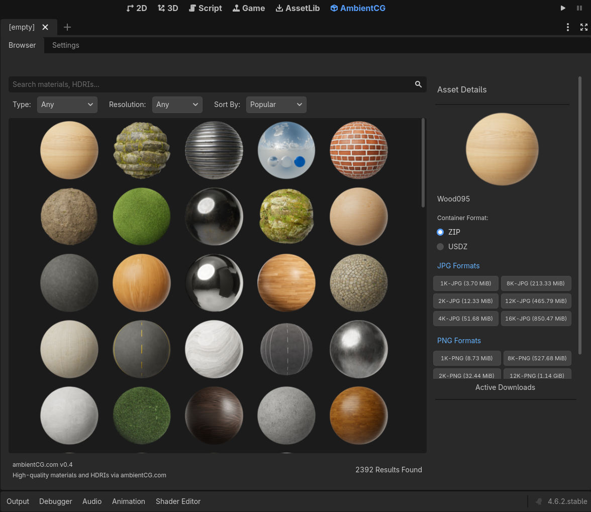
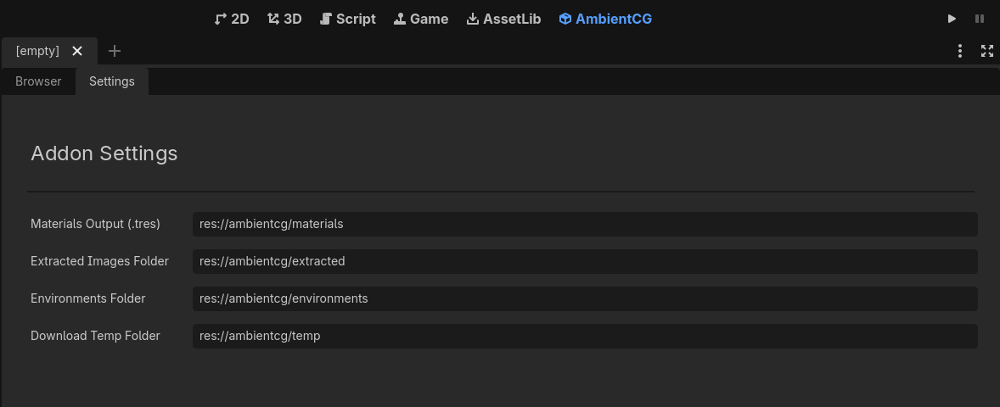

  
# ✦ AmbientCG ✦

Search, download, and automatically import PBR materials and HDRI environments directly from [ambientCG.com](https://ambientcg.com) into the Godot Engine.

> [!NOTE]
> This project was forked from [VenitStudios/AmbientCG](https://github.com/VenitStudios/AmbientCG) to modernize the workflow for Godot 4.

## CONTENTS

1. [Screenshots](#screenshots)
2. [Prerequisites](#prerequisites)
3. [Installation](#installation)
4. [Usage](#usage)
5. [Configuration](#configuration)
6. [Contributing](#contributing)
7. [Stonks!](#stonks)

## SCREENSHOTS

|            Asset Browser             |
| :----------------------------------: |
|  |

|             Plugin Settings             |
| :-------------------------------------: |
|  |

## PREREQUISITES

[!TIP]
Ensure you are using a modern version of Godot 4 for the best compatibility.

- **Godot Engine 4.4+** (Standard or .NET)
- Active Internet Connection (for asset fetching)

## INSTALLATION

1. Download or clone this repository.
2. Copy the `addons/ambientcg` folder into your project's `addons/` directory.
3. Navigate to **Project Settings > Plugins** and enable **AmbientCG**.

## USAGE

1. **Launch**: Click the **AmbientCG** button at the top-center of the Godot editor.
2. **Search**: Filter assets by keywords (e.g., "stone", "sky").
3. **Download**: Select a resolution and format. The plugin handles ZIP extraction and cleanup automatically.
4. **Integration**: Find your new `.tres` resources in the configured `res://ambientcg/` directories.

## CONFIGURATION

Adjust paths and behaviors in **Project Settings** under the `ambientcg/` section:

| Setting                      | Default Value                  | Description                            |
| :--------------------------- | :----------------------------- | :------------------------------------- |
| `extract_path`               | `res://ambientcg/extracted`    | Destination for raw asset files.       |
| `material_file_directory`    | `res://ambientcg/materials`    | Where `.tres` materials are generated. |
| `environment_file_directory` | `res://ambientcg/environments` | Where HDRI environments are saved.     |
| `download_path`              | `res://ambientcg/temp`         | Temporary storage for ZIP archives.    |

## DEVELOPMENT

This project uses `uv` for development task management.

- **Linting**: `uv run task lint`
- **Formatting**: `uv run task format`
- **Testing**: `uv run task test` (Requires Godot in PATH)

> [!WARNING]
> The automated test pipeline and local testing scripts are currently optimized for **Linux/Unix environments only**. Running tests on Windows is not supported at this time.

## CONTRIBUTING

Contributions are welcome! See [CONTRIBUTING.md](CONTRIBUTING.md) to get started.

> [!IMPORTANT]
> When submitting PRs, ensure you test in both a 3D scene and an empty project to verify path creation logic.

## STONKS!

  Made with ◈ by AzPepoze

